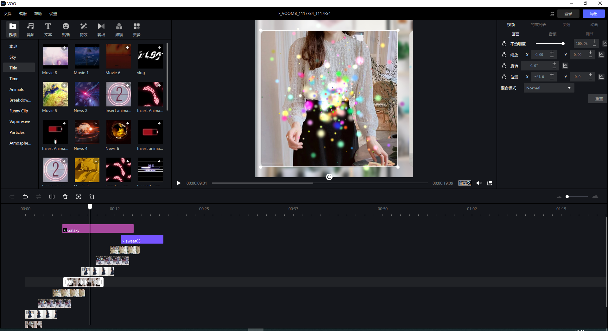

## 简介

VOO是由[欢聚集团(Joyy Inc.)](http://www.huanju.cn/)推出的视频剪辑软件。不仅可以用于剪辑视频，还可以制作视频模板并分享发布出去。里面包括的视频，音频，贴纸，文字，特效，转场，AI高级特效，粒子特效等多种素材，还有属性关键帧，曲线变速，动画等功能。[VOO官网](https://vooedit.com/)

## 主界面

## 开发环境搭建

支持：macOS 10.13及以上 (Xcode12+); Windows 10 (msvc2017)

Qt版本：5.12.10

Cmake：3.14+

IDE：
 Qt Creator （选择 [CMakeLists.txt](CMakeLists.txt) 文件作为工程打开）

 VS2017: 运行gen_msvs2017_cmake.bat批处理文件(运行前，需要将bat中的QT_DIR路径改为本地安装路径)，会生成msvs2017_cmake文件夹以及对应的Sln工程  [msvs2017_cmake](msvs2017_cmake) 

## License

[LGPL](./LICENSE.TXT)

